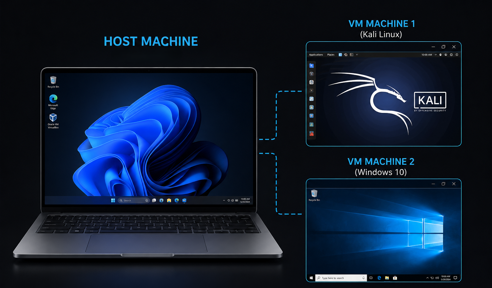
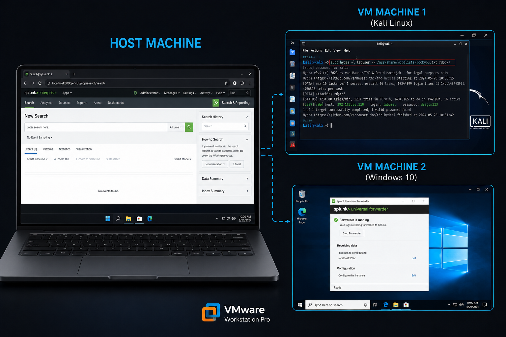

# SOC Analyst Home Lab

> **Hands-on cybersecurity lab simulating real-world Security Operations Center scenarios.**
> Built with VMware Workstation Pro, Splunk Enterprise, Kali Linux, and Windows 10.


---

## Table of Contents

- [Lab Overview](#lab-overview)
- [Environment](#environment)
- [Setup Guide](#setup-guide)
  - [Phase 1: VMware Workstation Pro](#phase-1-vmware-workstation-pro)
  - [Phase 2: Kali Linux VM](#phase-2-kali-linux-vm)
  - [Phase 3: Windows 10 VM](#phase-3-windows-10-vm)
  - [Phase 4: Splunk Enterprise](#phase-4-splunk-enterprise)
  - [Phase 5: Splunk Universal Forwarder](#phase-5-splunk-universal-forwarder)
  - [Phase 6: Network Verification](#phase-6-network-verification)
- [Labs](#labs)
  - [Lab 1: Brute Force Detection](docs/Lab1-Brute-force.md)
  - [Lab 2: Network Reconnaissance & Port Scan Detection](docs/Lab2-Network-Reconnaissance-&-Port-Scan.md)
  - [Lab 3: Beaconing / C2 Detection](docs/Lab3-C2-Beaconing.md)
- [MITRE ATT&CK Mapping](#mitre-attck-mapping)
- [Key Event IDs](#key-event-ids)
- [Author](#author)

---

## Lab Overview

This home lab provides hands-on experience in cybersecurity by simulating real-world systems and scenarios. Throughout the setup, you will work with virtual machines, networking, and security tools to understand how threats are detected and managed.

By the end, you will have practical skills in:
- **System configuration** and virtualization
- **Log analysis** and SIEM query writing (SPL)
- **Incident response** lifecycle (Detect → Triage → Contain → Investigate → Escalate → Remediate)
- **Threat detection** using Windows Event Logs and Sysmon
- **MITRE ATT&CK framework** mapping

### Lab Roadmap

| # | Scenario | Key Skills | MITRE |
|---|----------|----------|-------|
| 1 | [Brute Force Detection](docs/Lab1-Brute-force.md) | Failed logon analysis, threshold alerting | T1110.001 |
| 2 | [Network Reconnaissance](docs/Lab2-Network-Reconnaissance-&-Port-Scan.md) | Port scan detection, SYN analysis | T1046, T1595 |
| 3 | [C2 Beaconing](docs/Lab3-C2-Beaconing.md) | Timing analysis, connection patterns | T1071 |
| 4 | Privilege Escalation Detection | Process analysis, token manipulation | T1134 |
| 5 | Malware Detection | Behavioral analysis, hash verification | T1055 |
| 6 | Rule Tuning | False positive reduction, threshold optimization | — |
| 7 | Phishing Analysis | Email forensics, URL analysis | T1566 |

---

## Environment

| Component | Details |
|-----------|---------|
| **Host Machine** | Physical laptop/desktop (Windows 10/11) |
| **Hypervisor** | VMware Workstation Pro 25.x |
| **Attacker VM** | Kali Linux (VM 1) |
| **Target VM** | Windows 10 Pro (VM 2) |
| **SIEM** | Splunk Enterprise (on host) |
| **Forwarder** | Splunk Universal Forwarder (on Win10) |
| **EDR** | Microsoft Sysmon (on Win10) |

### Network Architecture

```
+-----------------------------------------+
|           HOST MACHINE                  |
|  +---------------------------------+    |
|  |     Splunk Enterprise           |    |
|  |     http://localhost:8000       |    |
|  +---------------------------------+    |
|              |                          |
|         VMnet1 (Host-only)              |
|         192.168.x.0/24                  |
|         |              |                |
|    +----+----+    +----+----+           |
|    | Kali    |    | Win10  |           |
|    | Linux   |<--> | Target |           |
|    | Attacker|    | Victim |           |
|    +---------+    +--------+           |
+-----------------------------------------+

```
-----


Image Illustration




---


Image illustration(After installation)



> **Warning:** All attack traffic stays inside the isolated Host-only network. Never expose these VMs to the internet.

---


## Setup Guide

### Prerequisites

| Requirement | Specification | Notes |
|-------------|---------------|-------|
| Host RAM | 16–32 GB | 12–16 GB allocated to VMs |
| Storage | 150+ GB free | Kali: 40 GB, Win10: 60 GB |
| CPU | 4+ cores with virtualization | Intel VT-x / AMD-V in BIOS |
| OS | Windows 10/11 host | Administrator access required |
| Network | Internet for downloads | VMs use isolated network |

---

### Phase 1: VMware Workstation Pro

#### Step 1 — Download VMware

VMware is now owned by Broadcom. All downloads require a free Broadcom account.

1. Go to: [https://support.broadcom.com](https://support.broadcom.com)
2. Register for a free account (verify email)
3. Navigate to: **My Downloads → VMware Workstation Pro**
4. Select version **25.x** (latest stable) for Windows
5. Download the `.exe` installer

> **Important:** Do NOT download VMware Workstation Pro 17 or earlier — they are end-of-life and no longer receive security updates.

#### Step 2 — Install VMware

Run the installer as Administrator. Use default settings with these exceptions:
- Uncheck **"Join the VMware Customer Experience..."** for privacy
- On first launch, select **"I want to use VMware Workstation 25 for Personal Use"** (free tier — fully featured)

#### Step 3 — Configure Virtual Networks

Open **Edit → Virtual Network Editor** (click "Change Settings" and approve UAC).

Confirm these networks exist:

| Name | Type | Subnet | Purpose |
|------|------|--------|---------|
| VMnet1 | Host-only | 192.168.x.0 | Isolated attack lab network |
| VMnet8 | NAT | 192.168.y.0 | Internet access for updates |

> **Tip:** Note your VMnet1 subnet IP. Run `ipconfig` on your host and look for:
> ```
> Ethernet adapter VMware Network Adapter VMnet1:
>    IPv4 Address......: 192.168.x.1
> ```

#### Step 4 — Set Memory Preferences

**Edit → Preferences → Memory**
- Reserved memory: **12–16 GB** total across all running VMs

**Edit → Preferences → Workspace**
- Default VM location: `C:\Users\YourName\Documents\Virtual Machines\`

#### Step 5 — Verify VMware Services

```powershell
Get-Service -Name "VMware*" | Select-Object Name, Status
```

All key services should show **Running**.

---

### Phase 2: Kali Linux VM

#### Step 6 — Download Kali Linux ISO

1. Go to: [https://www.kali.org/get-kali/#kali-installer-images](https://www.kali.org/get-kali/#kali-installer-images)
2. Download the **64-bit Installer Image**
3. Verify SHA256 checksum (optional):

```powershell
Get-FileHash "kalilinux-2025.2-installer-amd64.iso" -Algorithm SHA256
```

#### Step 7 — Create Kali VM

**File → New Virtual Machine → Typical**

| Setting | Value |
|---------|-------|
| Installer disc image | Browse to Kali ISO |
| Guest OS | Linux → Debian 12.x 64-bit |
| VM Name | `kali-attacker` |
| Location | `C:\Users\YourName\Documents\Virtual Machines\Kali Linux\` |
| Disk Size | 80 GB (Store as single file) |
| Memory | 4096 MB |
| Processors | 2 cores, 2 per processor |
| Network | NAT (for installation/updates) |

#### Step 8 — Install Kali Linux

Boot the VM and select **Graphical Install**:

| Setting | Value |
|---------|-------|
| Language | English |
| Location | Your region |
| Keyboard | American English |
| Hostname | `kali-attacker` |
| Domain | (leave blank) |
| Username | Your name |
| Password | Strong password (min 12 chars) |
| Partitioning | Guided — use entire disk → All files in one partition |
| Software | ✅ `top10tools` ✅ `SSH server` |

#### Step 9 — Update System & Install VMware Tools

```bash
sudo apt update && sudo apt upgrade -y
sudo apt install open-vm-tools open-vm-tools-desktop
sudo reboot
```

#### Step 10 — Verify Key Tools

```bash
nmap --version
hydra -h | head -5
msfconsole --version
wireshark --version
```

Install any missing tools:
```bash
sudo apt install -y nmap wireshark metasploit-framework hydra netcat-traditional
```

> **Take a snapshot:** `Kali-Clean Install` — Fresh install, tools verified, no attacks run yet.

---

### Phase 3: Windows 10 VM

#### Step 11 — Create Windows 10 ISO

1. Go to: [https://www.microsoft.com/software-download/windows10](https://www.microsoft.com/software-download/windows10)
2. Download the **Media Creation Tool**
3. Run as Administrator → **"Create installation media" → ISO file**
4. Save to: `C:\Users\YourName\Documents\Virtual Machines\Win10-Target\`

#### Step 12 — Create Windows 10 VM

**File → New Virtual Machine → Typical**

| Setting | Value |
|---------|-------|
| Installer disc image | Browse to Windows ISO |
| Guest OS | Microsoft Windows → Windows 10 x64 |
| VM Name | `Win10-Target` |
| Location | `C:\Users\YourName\Documents\Virtual Machines\Win10-Target\` |
| Disk Size | 60 GB (Store as single file) |
| Memory | 4096 MB |
| Processors | 2 cores, 2 per processor |
| Network | **Host-only** |

> **Important:** Select Windows 10 Pro during installation — Pro has RDP server built-in.

#### Step 13 — Windows OOBE Setup

| Setting | Value |
|---------|-------|
| Region | United States |
| Keyboard | US |
| Sign in | Click **"Domain join instead"** (creates local account) |
| Full name | `labuser` |
| Password | (set a password for RDP) |
| Privacy | Turn **ALL toggles OFF** |

#### Step 14 — Install VMware Tools

In VMware menu: **VM → Install VMware Tools**

Inside Win10 VM: File Explorer → DVD Drive (D:) → Setup → Next → Next → Install → Restart

#### Step 15 — Configure Windows 10

**Rename computer:**

```Powershell
Rename-Computer -NewName "Win10-Target" -Restart
```

**Enable RDP:**
```Powershell
Set-ItemProperty -Path 'HKLM:\System\CurrentControlSet\Control\Terminal Server' -Name "fDenyTSConnections" -Value 0
Enable-NetFirewallRule -DisplayGroup "Remote Desktop"
```

**Create weak victim account (for brute-force lab):**
```Powershell
New-LocalUser -Name "victim" -Password (ConvertTo-SecureString "Password123" -AsPlainText -Force) -FullName "Lab Victim" -Description "Weak account for brute-force lab"
Add-LocalGroupMember -Group "Remote Desktop Users" -Member "victim"
Add-LocalGroupMember -Group "Users" -Member "victim"
```

> **Security Warning:** This account is intentionally insecure. Only use inside an isolated Host-only network.

#### Step 16 — Install Sysmon

```Powershell
New-Item -ItemType Directory -Path "C:\Tools" -Force
Invoke-WebRequest -Uri "https://download.sysinternals.com/files/Sysmon.zip" -OutFile "C:\Tools\Sysmon.zip"
Expand-Archive -Path "C:\Tools\Sysmon.zip" -DestinationPath "C:\Tools\Sysmon\"
cd C:\Tools\Sysmon\
.\Sysmon64.exe -accepteula -i
```

Verify:
```Powershell
Get-Service Sysmon64
```

#### Step 17 — Enable Audit Logging

```Powershell
auditpol /set /subcategory:"Logon" /success:enable /failure:enable
auditpol /set /subcategory:"Credential Validation" /success:enable /failure:enable
```

Verify:
```Powershell
auditpol /get /category:*
```

> **Take a snapshot:** `Win10-Clean Install` — Fresh install, RDP enabled, victim account created, Sysmon running.

---

### Phase 4: Splunk Enterprise

#### Step 18 — Download & Install Splunk

1. Go to: [https://www.splunk.com/en_us/download/splunk-enterprise.html](https://www.splunk.com/en_us/download/splunk-enterprise.html)
2. Create a free Splunk account
3. Download the Windows `.msi` installer
4. Run as Administrator

| Setting | Value |
|---------|-------|
| License | Splunk Free (60-day trial / 500 MB/day) |
| Username | `admin` |
| Password | (set strong password) |
| Service Account | Local System |

#### Step 19 — Open Splunk Web

```
http://localhost:8000
```

Log in with admin credentials. Accept the license agreement.

#### Step 20 — Enable Receiving Port

**Settings → Forwarding and receiving → Configure receiving → New Receiving Port**

- Port number: `9997`
- Click **Save**

Verify port is listening:
```powershell
netstat -ano | findstr :9997
```

---

### Phase 5: Splunk Universal Forwarder

#### Step 21 — Download Forwarder

On your host machine:
1. Go to: [https://www.splunk.com/en_us/download/universal-forwarder.html](https://www.splunk.com/en_us/download/universal-forwarder.html)
2. Download Windows 64-bit installer
3. Copy to Win10-Target (drag-and-drop or shared folder)

#### Step 22 — Install Forwarder on Win10

Run as Administrator inside Win10-Target:

| Setting | Value |
|---------|-------|
| License | On-premises Splunk Enterprise |
| Username | `admin` |
| Password | (set forwarder admin password) |
| Deployment Server | (leave blank) |
| Receiving Indexer | Host's VMnet1 IP (e.g., `192.168.x.1`) |
| Port | `9997` |

#### Step 23 — Configure Log Inputs

```powershell
cd "C:\Program Files\SplunkUniversalForwarder\bin"

.\splunk.exe add monitor "WinEventLog://Security" --accept-license
.\splunk.exe add monitor "WinEventLog://System" --accept-license
.\splunk.exe add monitor "WinEventLog://Application" --accept-license
.\splunk.exe add monitor "WinEventLog://Microsoft-Windows-Sysmon/Operational" --accept-license

.\splunk.exe restart
```

#### Step 24 — Verify Forwarder Connection

```powershell
.\splunk.exe list forward-server
```

Expected output:
```
Active forwards: 192.168.x.x:9997
```

#### Step 25 — Test in Splunk Web

Run a search:
```spl
index=* host=Win10-Target
```

Set time range: **Last 15 minutes**

You should see Windows Event Log entries from Win10-Target.

> **Take a snapshot:** `Win10-Forwarder Configured` — Full log pipeline working.

---

### Phase 6: Network Verification

#### Step 26 — Verify VM Connectivity

Set both VMs to **Host-only** network mode.

**Check IPs:**
```bash
# On Kali
ip a
```
```cmd
:: On Win10
ipconfig
```

**Test ping:**
```bash
# From Kali
ping <Win10-IP>
```
```powershell
# From Win10
ping <Kali-IP>
```

If ping is blocked, allow ICMP on Windows:
```powershell
New-NetFirewallRule -DisplayName "Allow ICMPv4" -Protocol ICMPv4 -IcmpType 8 -Direction Inbound -Action Allow
```

**Setup Complete!** Your lab environment is ready.

---

## Labs

| # | Scenario | Details |
|---|----------|---------|
| 1 | [Brute Force Detection](docs/Lab1-Brute-force.md) | RDP brute force, EventCode 4625, threshold alerting |
| 2 | [Network Reconnaissance & Port Scan Detection](docs/Lab2-Network-Reconnaissance-&-Port-Scan.md)| Nmap scans, Sysmon EventCode 3, port enumeration |
| 3 | [Beaconing / C2 Detection](docs/Lab3-C2-Beaconing.md) | Timing analysis, connection patterns, beacon detection |
| 4 | Privilege Escalation Detection | *Coming soon* |
| 5 | Malware Detection | *Coming soon* |
| 6 | Rule Tuning | *Coming soon* |
| 7 | Phishing Analysis | *Coming soon* |

---

## MITRE ATT&CK Mapping

### Lab 1 — Brute Force

| Technique ID | Technique Name | Detail |
|--------------|----------------|--------|
| T1110 | Brute Force | Parent technique |
| T1110.001 | Password Guessing | Wordlist against RDP |
| T1078 | Valid Accounts | If brute force succeeds |
| T1021.001 | Remote Services: RDP | Access method used |
| T1133 | External Remote Services | RDP exposed externally |

**Kill Chain:**
```
Credential Access → [T1110.001] Brute Force RDP
    └── Success → [T1078] Valid Accounts
        └── [T1021.001] RDP Lateral Movement
```

### Lab 2 — Port Scanning

| ID | Technique | Context |
|----|-----------|---------|
| T1595 | Active Scanning | Attacker scans IP ranges and ports |
| T1595.001 | Scanning IP Blocks | nmap ping sweep (-sn) |
| T1595.002 | Vulnerability Scanning | nmap service detection (-sV -sC) |
| T1046 | Network Service Discovery | Full port enumeration (-p-) |
| T1590 | Gather Victim Network Information | OS fingerprinting (-O) |

**Kill Chain:**
```
Reconnaissance
    └── [T1595.001] Ping Sweep — host discovery
        └── [T1046] Port Scan — service enumeration
            └── [T1595.002] Version Detection — vulnerability mapping
                └── Weaponization → Exploitation
```

### Lab 3 — C2 Beaconing

| ID | Technique | Context |
|----|-----------|---------|
| T1071 | Application Layer Protocol | C2 communication channel |
| T1071.001 | Web Protocols | HTTP/HTTPS beaconing |
| T1001 | Data Obfuscation | Jitter / randomization in beacon timing |

---

## Key Event IDs

### Windows Security Log

| Event ID | Description |
|----------|-------------|
| 4624 | Successful logon — breach confirmation |
| 4625 | Failed logon — core brute force indicator |
| 4648 | Logon with explicit credentials |
| 4776 | NTLM credential validation attempt |
| 4740 | Account locked out |

### Sysmon

| Event ID | Description |
|----------|-------------|
| 1 | Process creation |
| 3 | Network connection — core scan/beacon detection |
| 7 | Image loaded |
| 8 | CreateRemoteThread |
| 10 | ProcessAccess |

### Windows Firewall

| Event ID | Description |
|----------|-------------|
| 5156 | Allowed connection through firewall |
| 5157 | Blocked connection — scan traffic |

### Logon Types

| Type | Name | Meaning |
|------|------|---------|
| 2 | Interactive | Logged in at keyboard/console |
| 3 | Network | Access over network (SMB, DC auth) |
| 4 | Batch | Scheduled tasks |
| 5 | Service | Service account logon |
| 7 | Unlock | Workstation unlock |
| 8 | NetworkCleartext | Cleartext credentials used |
| 9 | NewCredentials | RunAs with different creds |
| 10 | RemoteInteractive | RDP logon |
| 11 | CachedInteractive | Cached domain creds |

---

## Author

**SOC Analyst Home Lab** — Built for educational purposes in an isolated environment.

> **Disclaimer:** This lab was built for educational purposes in an isolated environment. No production systems were used. All attack traffic stays within the Host-only virtual network.

---

*Last updated: July 2026*
