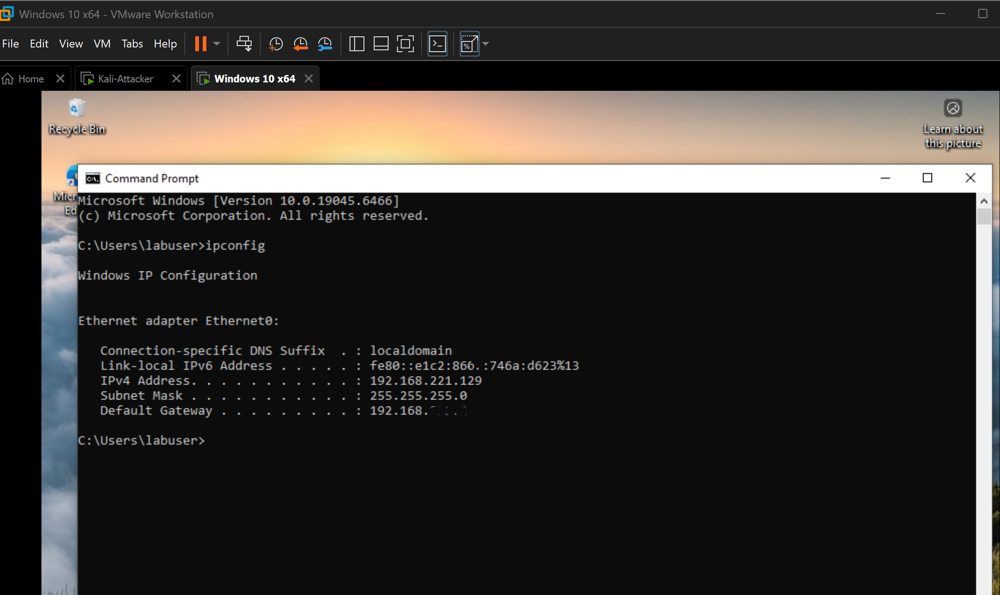
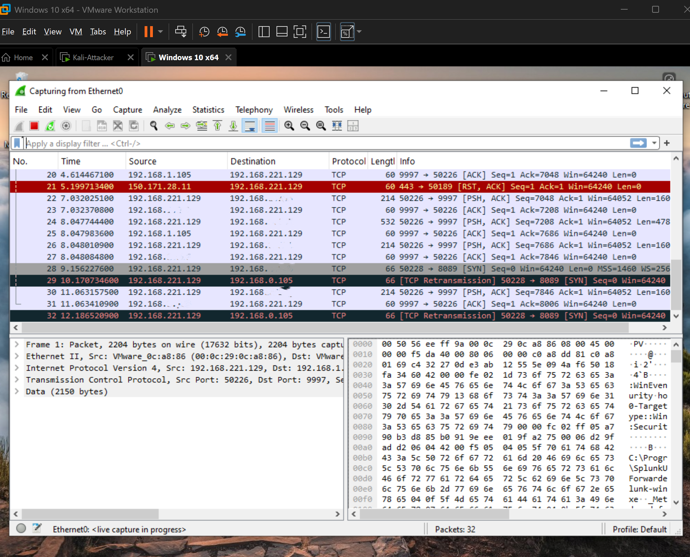
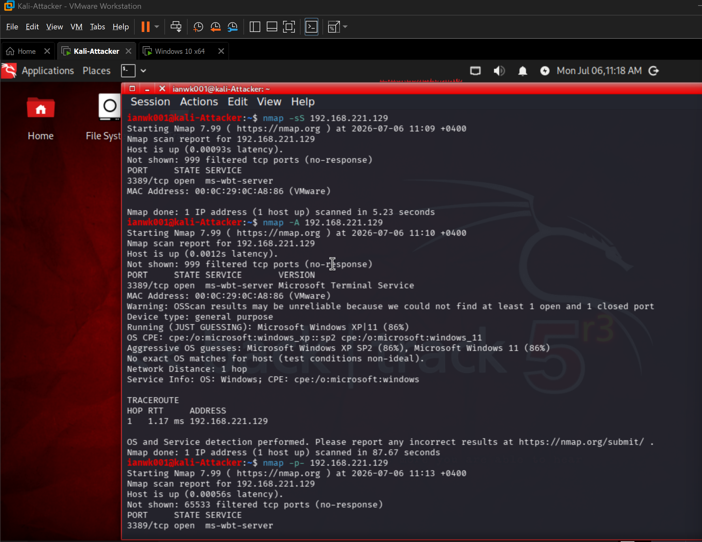
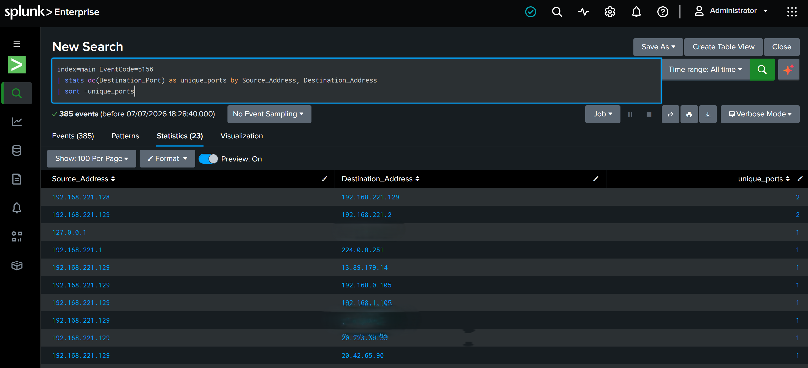

# Lab 2 — Network Reconnaissance & Port Scan Detection

**MITRE ATT&CK:** T1046 (Network Service Discovery), T1595 (Active Scanning)  
**Tools:** Nmap, Wireshark, Splunk, Sysmon, VMware

---

## Goal

Simulate Nmap port scans from Kali Linux against Windows 10 and detect scanning activity in Splunk by counting distinct destination ports from the same source IP.

---

## Environment

| Role | Machine | IP Address |
|------|---------|------------|
| Attacker | Kali Linux | 192.168.221.128 |
| Target | Windows 10 | 192.168.221.129 |
| SIEM | Splunk Enterprise | Host Machine |
| Packet Capture | Wireshark | Windows 10 VM |

---

## Lab Setup

1. Both VMs connected to the same isolated Host-only network
2. Windows 10 logging and forwarding to Splunk configured
3. Wireshark installed on Windows 10 VM
4. Clean snapshot taken before starting

---

## Attack Steps

### Step 1 — Confirm Target IP

On Windows 10 Target VM:

```cmd
ipconfig
```

Note the IPv4 address (e.g., `192.168.221.129`).



---

### Step 2 — Start Packet Capture on Windows

Open **Wireshark** on the Windows 10 VM:
1. Select the correct network adapter (Ethernet0)
2. Click the blue shark fin to start capturing



---

### Step 3 — Run Nmap Scans from Kali

From the Kali VM, launch multiple scan types against the Windows IP:

```bash
# Stealth SYN scan
nmap -sS 192.168.221.129

# Aggressive scan with service/OS detection
nmap -A 192.168.221.129

# All ports scan (1-65535)
nmap -p- 192.168.221.129

# OS fingerprinting
nmap -O 192.168.221.129

# Host discovery (ping sweep)
nmap -sn 192.168.221.129

# Full SYN port scan
nmap -sS -p- 192.168.221.129

# Service and version detection on specific ports
nmap -sV -sC -p 22,80,443,3389,445,139 192.168.221.129
```



---

### Step 4 — Observe SYN Packets in Wireshark

On Windows 10, apply this Wireshark display filter:

```
tcp.flags.syn==1 and tcp.flags.ack==0
```

This reveals a high volume of SYN packets from the Kali IP toward many different destination ports — the signature behavior of port scanning.

.png)

---

## Detection

### Phase 1 — DETECT

**Alert Triggers:**
- Sysmon EventCode 3 — burst of network connections to multiple destination ports from a single source IP in a short window
- Windows Firewall EventCode 5157 — blocked inbound connection attempts across multiple ports
- No corresponding application traffic pattern — pure port enumeration behavior

**Port Scan Detection Query:**

```spl
index=main EventCode=5156
| stats dc(Destination_Port) as unique_ports by Source_Address, Destination_Address
| where unique_ports > 15
```

**Timeline of Scan Activity:**

```spl
index=main EventCode=3 Source_Address="192.168.221.128"
| timechart span=10s count
```

**Which Ports Were Probed:**

```spl
index=main EventCode=3 Source_Address="192.168.221.128"
| stats count by Destination_Port
| sort -count
```

**Firewall Blocked Scan Traffic:**

```spl
index=main EventCode=5157
| stats dc(DestinationPort) as unique_ports by Source_Address, Destination_Address
| sort -unique_ports
```



---

### Phase 2 — TRIAGE

| Question | Where to Look |
|----------|---------------|
| Which IP is scanning? | Sysmon EventCode 3 → `Source_Address` field |
| Is the source internal or external? | Compare `Source_Address` against internal subnet range |
| How many ports were probed? | `dc(DestinationPort)` in Splunk results |
| How long did the scan last? | Earliest vs latest `_time` in results |
| Did the scan find open ports? | Check which `DestinationPort` values received responses |
| Did anything follow the scan? | Check for EventCode 4624/4625 from same IP post-scan |

**Severity Classification:**

| Scenario | Severity | Action |
|----------|----------|--------|
| Internal IP scanning internally | **Medium** | Possible compromised host or insider threat |
| External IP scanning perimeter | **High** | Active external reconnaissance |
| Scan immediately followed by exploitation | **Critical** | Escalate immediately |

---

### Phase 3 — CONTAIN

**Immediate Actions:**

```powershell
# Block scanning IP at Windows Firewall (if internal attacker)
netsh advfirewall firewall add rule name="Block Scanner" dir=in action=block remoteip=192.168.221.128
```

```bash
# Block at Linux perimeter firewall
sudo ufw deny from 192.168.221.128 to any
```

1. Block scanning IP at perimeter firewall
2. If source is internal — isolate that host immediately
3. Check if any scanned ports led to follow-on connections
4. Notify L2 if source is confirmed external

---

### Phase 4 — INVESTIGATE

**Did the scanner connect to open ports after scanning?**

```spl
index=main EventCode=3 Source_Address="192.168.221.128"
| stats count by DestinationPort
| sort -count
```

**Any login attempts from scanning IP after scan completed?**

```spl
index=main (EventCode=4624 OR EventCode=4625) src_ip="192.168.221.128"
| table _time, EventCode, Account_Name, src_ip, Logon_Type
| sort _time
```

**Any other hosts scanned from same source?**

```spl
index=main EventCode=3 Source_Address="192.168.221.128"
| stats dc(DestinationIp) as hosts_scanned, values(DestinationIp) as targets by SourceIp
```

**Sysmon process on attacker host (if Sysmon on Kali):**

```spl
index=main EventCode=1 Source_Address="192.168.221.128"
| table _time, Image, CommandLine, User
```

**Attack Timeline:**

```
[T+0]    First Sysmon EventCode 3 from KALI_IP
[T+xs]   Burst of connections across multiple ports — scan pattern confirmed
[T+ym]   Scan ends — unique_ports count peaks
[T+zm]   Any EventCode 4624/4625 from same IP? → exploitation attempt
```

---

### Phase 5 — ESCALATE & DOCUMENT

**Escalate to L2 when:**
- Scan source is confirmed external IP
- Scan is immediately followed by login attempts or exploitation
- Multiple internal hosts scanned (lateral reconnaissance after initial compromise)
- Scan pattern matches known threat actor tooling

**Incident Report Template:**

```markdown
## INCIDENT REPORT — Network Port Scan / Reconnaissance

| Field | Value |
|-------|-------|
| Detection Time | [timestamp] |
| Alert Source | Splunk — Sysmon EventCode 3 dc(DestinationPort) threshold |
| Scanning IP | 192.168.221.128 (internal/external) |
| Target Host | Win10-Target |
| Ports Probed | [count] unique ports |
| Scan Duration | [start_time] to [end_time] |
| Open Ports Found | [list ports with inbound connections] |
| Follow-on Action | Yes / No — [login attempts / exploit attempts] |
| Actions Taken | Scanning IP blocked, L2 notified |
| Escalated To | [L2 analyst name] |
| MITRE ATT&CK | T1046 / T1595 |
```

---

### Phase 6 — REMEDIATE

| Fix | Reason |
|-----|--------|
| Enable host-based firewall on all endpoints | Blocks unsolicited inbound probes |
| Deploy IDS/IPS (Snort / Suricata) | Detects nmap scan signatures automatically |
| Enable Sysmon with network logging (EventCode 3) | Core visibility for scan detection |
| Network segmentation / VLANs | Limits which hosts an attacker can reach |
| Alert rule: dc(DestinationPort) > 15 in 60s | Automates detection, removes manual review |
| Geo-block external IP ranges at perimeter | Reduces external reconnaissance exposure |
| Disable unnecessary open ports / services | Shrinks the attack surface being scanned |

---

## MITRE ATT&CK Mapping

| ID | Technique | Context |
|----|-----------|---------|
| T1595 | Active Scanning | Attacker scans IP ranges and ports |
| T1595.001 | Scanning IP Blocks | nmap ping sweep (`-sn`) |
| T1595.002 | Vulnerability Scanning | nmap service detection (`-sV -sC`) |
| T1046 | Network Service Discovery | Full port enumeration (`-p-`) |
| T1590 | Gather Victim Network Information | OS fingerprinting (`-O`) |

**Kill Chain:**

```
Reconnaissance
    └── [T1595.001] Ping Sweep — Host Discovery
        └── [T1046] Port Scan — Service Enumeration
            └── [T1595.002] Version Detection — Vulnerability Mapping
                └── Weaponization → Exploitation
```

---

## Key Event IDs

| Event ID | Source | What It Shows |
|----------|--------|---------------|
| Sysmon 3 | Sysmon | Network connection — core scan detection |
| 5156 | Windows Firewall | Allowed connection through firewall |
| 5157 | Windows Firewall | Blocked connection — scan traffic |
| Sysmon 1 | Sysmon | Process creation (nmap on host, if applicable) |
| 4625 | Security | Failed logon — if scan leads to brute force |

---

## Lab Checklist

- [x] Ran nmap ping sweep, SYN scan, and service detection from Kali
- [x] Confirmed Sysmon EventCode 3 burst appeared in Splunk
- [x] Built SPL query with dc(DestinationPort) > 15 threshold
- [x] Identified scanning IP and ports probed in Splunk
- [x] Checked for follow-on exploitation attempts post-scan
- [x] Completed incident ticket
- [x] Mapped to MITRE T1046 / T1595

---

## What I Learned

- **Sysmon EventCode 3** provides essential network connection visibility for detecting port scans
- **`dc()` (distinct count)** is the key SPL function for identifying scan behavior — counting unique destination ports from a single source
- **SYN packets without corresponding ACK responses** indicate port scanning vs. legitimate traffic
- **Timing analysis** helps distinguish automated scans from manual probing
- **Reconnaissance is often the first step** before exploitation — detecting it early prevents breaches
- A single port scan can reveal **service versions and OS information**, making vulnerability mapping possible
